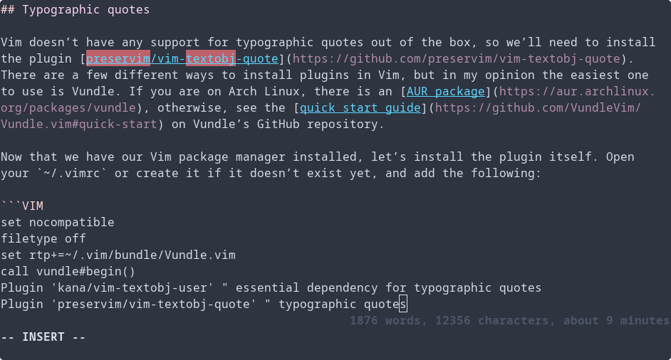

There are a lot of tools that are, for the most part, only used in the programming sphere that could do a lot of good if they received adoption among the wider non-technical community. Git and Markdown especially. Version control is useful to anyone who works on text files and needs to be able to revert back to a previous version, and Markdown is a simple and succinct way to format simple text documents — especially compared with Microsoft Office.

Another tool that could see wider adoption is Vim, especially among writers looking for a powerful yet minimal text editor, and are willing to invest some time into learning it.

I switched over to Vim a couple weeks ago from GNU nano and [VSCodium](https://vscodium.com/) (a free and open source build of VS Code), and I haven’t looked back since. However, out of the box, Vim isn’t configured to excel at anything, besides perhaps basic configuration file editing. In this guide, I’ll go over how to configure Vim for writing, assuming you’re writing in Markdown files.

When you’re done, your Vim will look something like this:



I will cover the following, **assuming you are slightly familiar with basic editing in Vim:**

- How to set Vim to have soft line breaks at words, not characters, so no words are split across lines
- How to use smart/typographic quotes (i.e. `“”` instead of the standard ASCII `""`)
- How to enable spellcheck
  - How to prevent Chinese, Japanese, and Korean (CJK) characters from being flagged as spelling mistakes
  - How to patch your dictionary to include words with typographic apostrophes (by default, words such as `doesn’t` will be flagged as misspelled but `does't` won’t be)
- How to add a custom status bar that displays word count, character count, and estimated reading time

With the introduction out of the way, let’s get right into it!

## Soft line breaks

Most Vim configurations are done in the user’s `~/.vimrc` file, which applies to all Vim sessions regardless of file type. However, we want our customizations to only apply to Markdown text files. Luckily, Vim has a feature that handles this. [Filetype plugins](https://vim.fandom.com/wiki/File_type_plugins) allow you to create Vim configurations that only apply to certain filetypes, and are stored in the directory `~/.vim/ftplugin/`. We are going to create one for our Markdown files: `~/.vim/ftplugin/markdown.vim`.

Inside this file, add the following:

```VIM
setlocal linebreak
```

We want to use `setlocal` (or its shorthand `setl`) over the usual `set` because this only sets `linebreak` on the current buffer. If we have multiple files open in Vim, we want to make sure that this setting only applies to open Markdown files.

<details>
<summary>Thanks to <a href="https://www.reddit.com/user/habamax/">u/habamax</a> for pointing this out!</summary>
<iframe id="reddit-embed" src="https://www.redditmedia.com/r/vim/comments/vc9oi2/how_to_configure_vim_for_writing/iccz7kq/?depth=1&amp;showmore=false&amp;embed=true&amp;showmedia=false" sandbox="allow-scripts allow-same-origin allow-popups" style="border: none;" scrolling="no" width="640" height="233"></iframe>
</details><br>

And you’re done! Vim will now no longer split words across soft-wrapped lines. Now, let’s move on to typographic quotes.

## Typographic quotes

Vim doesn’t have any native support for typographic quotes, so we’ll need to install the plugin [preservim/vim-textobj-quote](https://github.com/preservim/vim-textobj-quote). There are a few different ways to install plugins in Vim, but in my opinion the easiest one to use is Vundle. If you are on Arch Linux, there is an [AUR package](https://aur.archlinux.org/packages/vundle), otherwise, see the [quick start guide](https://github.com/VundleVim/Vundle.vim#quick-start) on Vundle’s GitHub repository.

Now that we have a package manager for Vim installed, we need to install the plugin itself. Open your `~/.vimrc`, or create it if it doesn’t exist yet, and add the following:

```VIM
filetype off
set rtp+=~/.vim/bundle/Vundle.vim
call vundle#begin()
Plugin 'kana/vim-textobj-user' " essential dependency for typographic quotes
Plugin 'preservim/vim-textobj-quote' " typographic quotes
call vundle#end()
filetype plugin indent on
```

If you are unfamilar with Vundle, between `vundle#begin()` and `vundle#end()` is where all of the Vim plugins you want installed with Vundle are listed; the rest of the lines are various requirements for Vundle to work properly (for more information, see [Vundle’s quick start guide](https://github.com/VundleVim/Vundle.vim#quick-start)). By default, Vundle assumes the plugins to be GitHub repositories, so all you need to write down is the repository name. [kana/vim-textobj-user](https://github.com/kana/vim-textobj-user) is an essential dependency for our typographic quote plugin that will handle text objects.

Now that you’ve listed the necessary plugins, you need to have Vundle install them. Save and exit `~/.vimrc`, open Vim, type `:PluginInstall`, and press enter. If you’ve done everything correctly, Vundle should pull all of the necessary plugins from GitHub, and once it’s done you can type `:q` to exit the installation window.

The typographic quotes plugin is now installed, but it won’t start up by default. Since we only want it to run on Markdown files, we open up `~/.vim/ftplugins/markdown.vim` again and add the following:

```VIM
call textobj#quote#init()
```

This will initialize the typographic quote plugin whenever you enter a Markdown file.

### Useful commands

- Sometimes you may want to override the plugin to type non-typographic quotes. To do this, press <kbd>Ctrl</kbd> + <kbd>V</kbd> (**V** for **V**erbatim) and then type the single or double quotation mark.
- This plugin can also convert preexisting text to typographic quotes. There are [instructions on how to do this on the plugin’s repository](https://github.com/preservim/vim-textobj-quote#replace-support), but I was having some difficulty getting them to work.

  I ended up slightly using a slightly modified version of the instructions which maps <kbd>\c</kbd> to run the plugin replacing straight quotes with typographic “curly” quotes, and <kbd>\s</kbd> to do the inverse. (You can replace the backslash with any character, provided it isn’t already mapped. The backslash key is handy, however, since it’s one of the few keys that isn’t connected to any commands in Vim’s default configuration.)

  ```VIM
  map \c <plug>ReplaceWithCurly
  map \s <plug>ReplaceWithStraight
  ```

  In normal mode, these commands replace all occurrences in the current paragraph, and in visual mode (how you do visual selection in Vim: press <kbd>v</kbd> while in normal mode) they replace all occurrences in the current selection. To replace throughout the entire document, Press <kbd>gg</kbd> to go to the top of the document, <kbd>v</kbd> to enter visual mode, <kbd>G</kbd> to jump to the last line of the document, <kbd>$</kbd> to go to the last character, selecting everything, and finally either <kbd>\c</kbd> or <kbd>\s</kbd> to run the plugin command. So, altogether: <kbd>ggvG$</kbd> + either <kbd>\c</kbd> for curly quotes or <kbd>\s</kbd> for straight quotes.
- For more information and advanced usage, [see the plugin’s README](https://github.com/preservim/vim-textobj-quote#vim-textobj-quote).

## Spellcheck

To enable spellcheck, add the following to your `~/.vim/ftplugin/.markdown.md`:

```VIM
set spell spelllang=en
set spelllang+=cjk " prevent CJK characters from being spellchecked
```

Of course, if you want spellchecking in another language, change `en` to whatever your language code is. The second line is optional, however if you often work with documents including Chinese, Japanese, or Korean (CJK) characters like me, this is handy since otherwise Vim will mark them all as spelling mistakes.

### Useful commands

- <kbd>zg</kbd> adds a word to the dictionary
- <kbd>z=</kbd> brings a list of possible corrections for misspelled words
- <kbd>zug</kbd> or <kbd>zuw</kbd> removes a word from the dictionary
- `:set nospell` disables spellchecking for the current document
- `:set spell` enables spellchecking for the current document

### Patching dictionary for typographic quotes

If you decided to skip the typographic quotes configuration from earlier, you can stop here, but otherwise we’re going to have to patch our Vim spellcheck dictionary to include words with typographic apostrophes/single quotes (e.g. `doesn’t`) which will be marked as incorrect otherwise.

[This](https://vi.stackexchange.com/q/118) thread on the Vi and Vim Stack Exchange was very helpful, so if you’re having any trouble please refer to the two answers there.

First, create the directory `~/.vim/spell` and enter it. We’re going to need two dictionary files, which are available [here](http://wordlist.aspell.net/dicts/). Please check to see if there has been a newer version on the website and `wget` that instead, if the one I’m using (2020.12.07) has become out of date. I’m going to use the American English (setting `_LANG` to `en_US`) dictionary file, but Canadian (`en_CA`) and Australian (`en_AU`) English dictionaries are also available. If you need British English or larger word list, more archive downloads are available [here](https://sourceforge.net/projects/wordlist/files/speller/2020.12.07/), although I haven’t tested them.

```SH
$ mkdir -p ~/.vim/spell && cd ~/.vim/spell
$ _LANG=en_US # language variable for future commands, replace if needed
$ wget http://downloads.sourceforge.net/wordlist/hunspell-$_LANG-2020.12.07.zip
$ unzip *.zip $_LANG* && rm *.zip
```

In order to patch the dictionary, run the following command (see [this](https://vi.stackexchange.com/a/172) for an explanation of how it works). It takes all occurrences of words with apostrophes in the dictionary file and appends a version with the typographic version.

```SH
$ grep "'" $_LANG.dic | sed "s/'/’/g" >> $_LANG.dic
```

Then, still in the `~/.vim/spell` directory, start Vim, and run the `:mkspell! en en_US` command, which should create an `en.utf-8.spl` file. You’re done!

If you find more compatible dictionary files besides English that are confirmed working, please let me know and I’ll add them to this article.

## Custom status bar

Now, for the cherry on top: a custom status bar!

Add the following to your `~/.vim/ftplugin/markdown.vim`:

```VIM
function! Characters()
        return strchars(join(getline(1, '$'), "\n"))
endfunction

function! Words()
        return wordcount().words
endfunction

function! Minutes()
        let wpm = 200
        return (Words() + wpm / 2) / wpm
endfunction

set laststatus=2 " enable status line
set statusline+=%=%{Words()}\ words,
set statusline+=\ %{Characters()}\ characters,\ about
set statusline+=\ %{Minutes()}\ minutes
" remove ugly white background
hi StatusLine ctermfg=0 ctermbg=none cterm=bold " 0 for the terminal color 0
```

I haven’t done any Vimscript before working on this configuration, so this is mostly cobbled this together from a few Stack Overflow threads. There might be better ways of doing some things!

The main things of note are the following:

- `strchars` is the only correct way to count the number of characters in a string. Many people suggest methods that count the number of bytes, but Unicode characters outside of ASCII will take up more than one byte and thus be counted as more than one character.
- If you need a byte counter in your status line, you can use `wordcount().bytes`.
- The `%=` in the first `set statusline+=` line makes everything following right-aligned.
- Spaces must be escaped using `\ ` when adding to the status line.
- By default, the status line background is bright white, so in the final line `ctermbg=none` removes this and makes it more subtle.
- I didn’t want my status line to be brighter than my text and distracting, so I set its foreground color to `0` in the final line. In my terminal color palette, this is a subdued color, but you can try using any value between 0 and 15.

## Conclusion

That’s all for this tutorial! I hope it was useful to you. For the last couple of weeks, I’ve been learning to use and configure Vim, and it’s been a lot of fun. I made this article to share what I’ve learned, and also as a future reference for myself. Writing can be a good way of solidifying your knowledge, and I learned a lot writing this. This is my first “proper” blog post, so I hope it was alright. I’ll be writing more in the future!

Oh, and one more bonus tip. The normal <kbd>j</kbd> and <kbd>k</kbd> navigation commands for going up or and down a line in Vim go over “hard” lines in the document, not soft-wrapped visual lines. If you want to go over visual lines as one often does when writing, prefix the command with <kbd>g</kbd> (for graphical, I guess?). So, for example, to go down one graphical line, use <kbd>gj</kbd>. You can even prefix the chord with a number to repeat it multiple times, so to go up three visual lines, use <kbd>3gk</kbd>! If you need to do this a lot, you might want to look into [creating a custom mapping](https://vim.fandom.com/wiki/Mapping_keys_in_Vim_-_Tutorial_(Part_1)).

See you in the next post!
